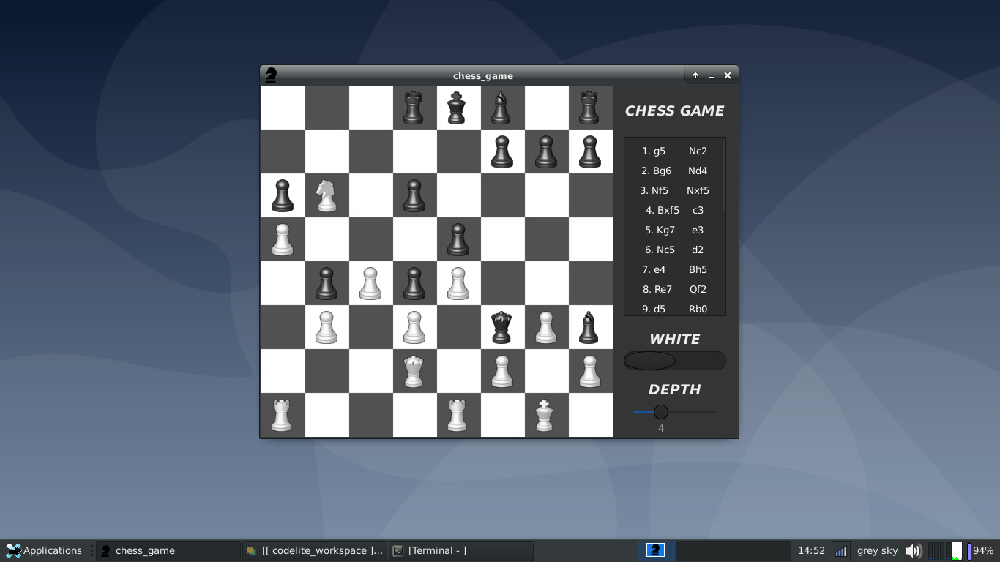
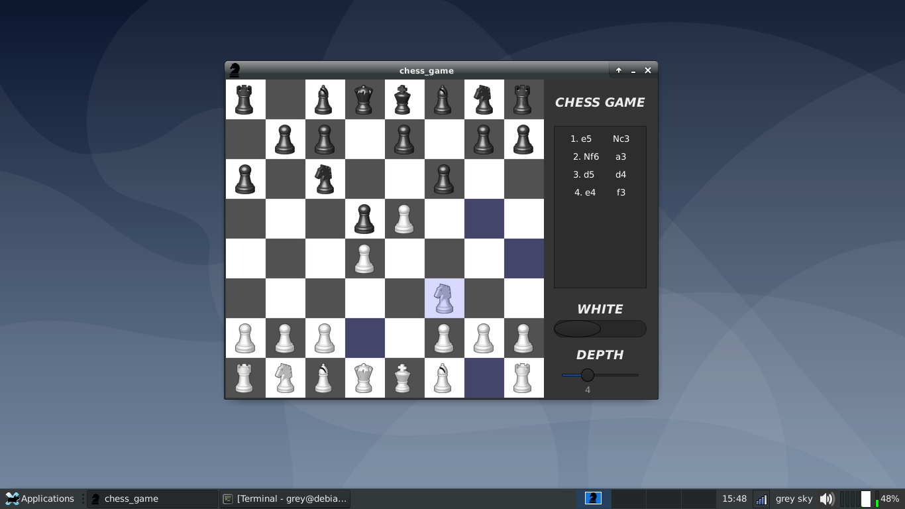

# chess_game
It is a chess engine written in C

Uses minimax and alpha-beta pruning algorithms  
It calculates next movement in 1 second when tree depth is lower than 5 at beginning and middle of the game  
It calculates next movement in 1 second when tree depth is lower than 6 at endings of the game  

